# Lưu đồ tiếp cận OSCE Sản khoa Y21

Nguồn duy nhất: file Tổng hợp OSCE Y21 (bản viết lại từng bước, `osce-y21/TongHop_OSCE_Y21_TungBuoc.md`). Không bổ sung nguồn ngoài. Chỗ nào file không ghi thì lưu đồ để ô **"⚠ File không ghi"**.

Ký hiệu: ô chữ nhật = bước làm; ô thoi = câu hỏi rẽ nhánh; ô đỏ = chấm dứt thai kỳ / cấp cứu; ô vàng nhạt = file không ghi.

## CHƯƠNG 1: 3 THÁNG ĐẦU THAI KỲ

### 1. Khám thai lần đầu / trễ kinh (hỏi bệnh sử khám thai thường quy)

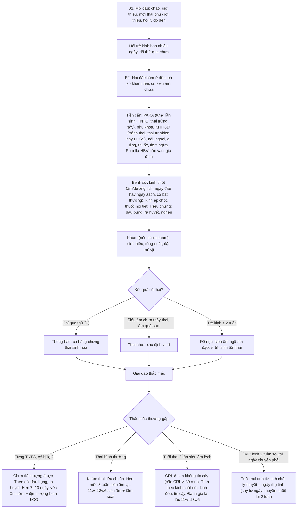
```mermaid
flowchart TD
  A["B1. Mở đầu: chào, giới thiệu, mời thai phụ giới thiệu, hỏi lý do đến"] --> A2["Hỏi trễ kinh bao nhiêu ngày, đã thử que chưa"]
  A2 --> B["B2. Hỏi đã khám ở đâu, có sổ khám thai, có siêu âm chưa"]
  B --> C["Tiền căn: PARA (từng lần sinh, TNTC, thai trứng, sẩy), phụ khoa, KHHGĐ (tránh thai, thai tự nhiên hay HTSS), nội, ngoại, dị ứng, thuốc, tiêm ngừa Rubella HBV uốn ván, gia đình"]
  C --> D["Bệnh sử: kinh chót (âm/dương lịch, ngày đầu hay ngày sạch, có bất thường), kinh áp chót, thuốc nội tiết. Triệu chứng: đau bụng, ra huyết, nghén"]
  D --> E["Khám (nếu chưa khám): sinh hiệu, tổng quát, đặt mỏ vịt"]
  E --> F{"Kết quả có thai?"}
  F -->|"Chỉ que thử (+)"| G["Thông báo: có bằng chứng thai sinh hóa"]
  F -->|"Siêu âm chưa thấy thai, làm quá sớm"| H["Thai chưa xác định vị trí"]
  F -->|"Trễ kinh ≥ 2 tuần"| I["Đề nghị siêu âm ngã âm đạo: vị trí, sinh tồn thai"]
  G --> J["Giải đáp thắc mắc"]
  H --> J
  I --> J
  J --> K{"Thắc mắc thường gặp"}
  K -->|"Từng TNTC, có bị lại?"| K1["Chưa tiên lượng được. Theo dõi đau bụng, ra huyết. Hẹn 7–10 ngày siêu âm sớm + định lượng beta-hCG"]
  K -->|"Thai bình thường"| K2["Khám thai tiêu chuẩn. Hẹn mốc 8 tuần siêu âm lại, 11w–13w6 siêu âm + tầm soát"]
  K -->|"Tuổi thai 2 lần siêu âm lệch"| K3["CRL 6 mm không tin cậy (cần CRL ≥ 30 mm). Tính theo kinh chót nếu kinh đều, tin cậy. Đánh giá lại lúc 11w–13w6"]
  K -->|"IVF: lệch 2 tuần so với ngày chuyển phôi"| K4["Tuổi thai tính từ kinh chót lý thuyết = ngày thụ tinh (suy từ ngày chuyển phôi) lùi 2 tuần"]
```

### 2. Xuất huyết âm đạo 3 tháng đầu

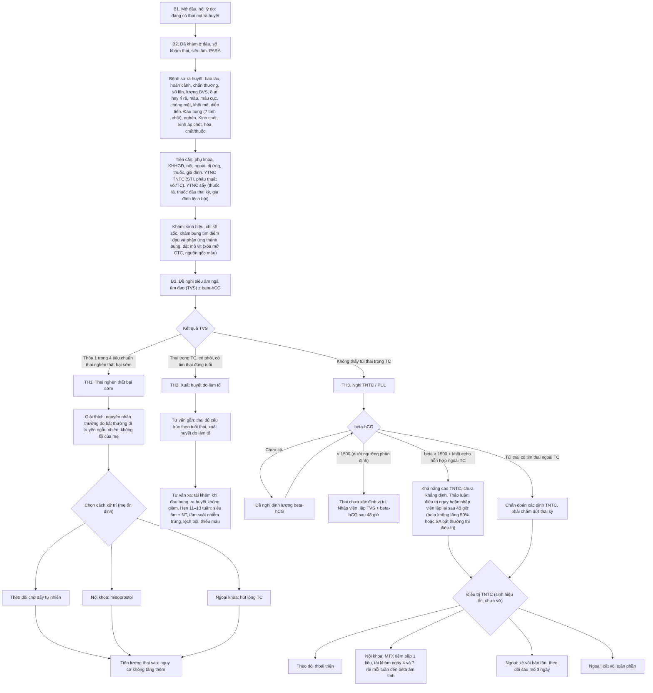
```mermaid
flowchart TD
  A["B1. Mở đầu, hỏi lý do: đang có thai mà ra huyết"] --> B["B2. Đã khám ở đâu, sổ khám thai, siêu âm. PARA"]
  B --> C["Bệnh sử ra huyết: bao lâu, hoàn cảnh, chấn thương, số lần, lượng BVS, ồ ạt hay rỉ rả, màu, máu cục, chóng mặt, khối mô, diễn tiến. Đau bụng (7 tính chất), nghén. Kinh chót, kinh áp chót, hóa chất/thuốc"]
  C --> D["Tiền căn: phụ khoa, KHHGĐ, nội, ngoại, dị ứng, thuốc, gia đình. YTNC TNTC (STI, phẫu thuật vòi/TC). YTNC sẩy (thuốc lá, thuốc đầu thai kỳ, gia đình lệch bội)"]
  D --> E["Khám: sinh hiệu, chỉ số sốc, khám bụng tìm điểm đau và phản ứng thành bụng, đặt mỏ vịt (xóa mở CTC, nguồn gốc máu)"]
  E --> F["B3. Đề nghị siêu âm ngã âm đạo (TVS) ± beta-hCG"]
  F --> G{"Kết quả TVS"}
  G -->|"Thỏa 1 trong 4 tiêu chuẩn thai nghén thất bại sớm"| H["TH1. Thai nghén thất bại sớm"]
  G -->|"Thai trong TC, có phôi, có tim thai đúng tuổi"| I["TH2. Xuất huyết do làm tổ"]
  G -->|"Không thấy túi thai trong TC"| J["TH3. Nghi TNTC / PUL"]
  H --> H1["Giải thích: nguyên nhân thường do bất thường di truyền ngẫu nhiên, không lỗi của mẹ"]
  H1 --> H2{"Chọn cách xử trí (mẹ ổn định)"}
  H2 --> H3["Theo dõi chờ sẩy tự nhiên"]
  H2 --> H4["Nội khoa: misoprostol"]
  H2 --> H5["Ngoại khoa: hút lòng TC"]
  H3 --> H6["Tiên lượng thai sau: nguy cơ không tăng thêm"]
  H4 --> H6
  H5 --> H6
  I --> I1["Tư vấn gần: thai đủ cấu trúc theo tuổi thai, xuất huyết do làm tổ"]
  I1 --> I2["Tư vấn xa: tái khám khi đau bụng, ra huyết không giảm. Hẹn 11–13 tuần: siêu âm + NT, tầm soát nhiễm trùng, lệch bội, thiếu máu"]
  J --> J1{"beta-hCG"}
  J1 -->|"Chưa có"| J2["Đề nghị định lượng beta-hCG"]
  J1 -->|"< 1500 (dưới ngưỡng phân định)"| J3["Thai chưa xác định vị trí. Nhập viện, lặp TVS + beta-hCG sau 48 giờ"]
  J1 -->|"beta > 1500 + khối echo hỗn hợp ngoài TC"| J4["Khả năng cao TNTC, chưa khẳng định. Thảo luận: điều trị ngay hoặc nhập viện lặp lại sau 48 giờ (beta không tăng 50% hoặc SA bất thường thì điều trị)"]
  J1 -->|"Túi thai có tim thai ngoài TC"| J5["Chẩn đoán xác định TNTC, phải chấm dứt thai kỳ"]
  J2 --> J1
  J4 --> K{"Điều trị TNTC (sinh hiệu ổn, chưa vỡ)"}
  J5 --> K
  K --> K1["Theo dõi thoái triển"]
  K --> K2["Nội khoa: MTX tiêm bắp 1 liều, tái khám ngày 4 và 7, rồi mỗi tuần đến beta âm tính"]
  K --> K3["Ngoại: xẻ vòi bảo tồn, theo dõi sau mổ 3 ngày"]
  K --> K4["Ngoại: cắt vòi toàn phần"]
```

## CHƯƠNG 2: NỬA ĐẦU THAI KỲ

### 3. Rubella

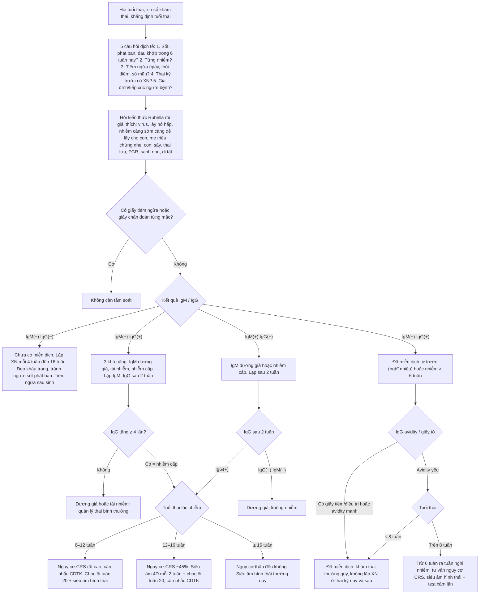
```mermaid
flowchart TD
  A["Hỏi tuổi thai, xin sổ khám thai, khẳng định tuổi thai"] --> B["5 câu hỏi dịch tễ: 1. Sốt, phát ban, đau khớp trong 6 tuần nay? 2. Từng nhiễm? 3. Tiêm ngừa (giấy, thời điểm, số mũi)? 4. Thai kỳ trước có XN? 5. Gia đình/tiếp xúc người bệnh?"]
  B --> C["Hỏi kiến thức Rubella rồi giải thích: virus, lây hô hấp, nhiễm càng sớm càng dễ lây cho con, mẹ triệu chứng nhẹ, con: sẩy, thai lưu, FGR, sanh non, dị tật"]
  C --> D{"Có giấy tiêm ngừa hoặc giấy chẩn đoán từng mắc?"}
  D -->|"Có"| D1["Không cần tầm soát"]
  D -->|"Không"| E{"Kết quả IgM / IgG"}
  E -->|"IgM(−) IgG(−)"| F["Chưa có miễn dịch. Lặp XN mỗi 4 tuần đến 16 tuần. Đeo khẩu trang, tránh người sốt phát ban. Tiêm ngừa sau sinh"]
  E -->|"IgM(+) IgG(+)"| G["3 khả năng: IgM dương giả, tái nhiễm, nhiễm cấp. Lặp IgM, IgG sau 2 tuần"]
  G --> G1{"IgG tăng ≥ 4 lần?"}
  G1 -->|"Không"| G2["Dương giả hoặc tái nhiễm: quản lý thai bình thường"]
  G1 -->|"Có = nhiễm cấp"| H{"Tuổi thai lúc nhiễm"}
  H -->|"6–12 tuần"| H1["Nguy cơ CRS rất cao, cân nhắc CDTK. Chọc ối tuần 20 + siêu âm hình thái"]
  H -->|"12–16 tuần"| H2["Nguy cơ CRS ~45%. Siêu âm 4D mỗi 2 tuần + chọc ối tuần 20, cân nhắc CDTK"]
  H -->|"≥ 16 tuần"| H3["Nguy cơ thấp đến không. Siêu âm hình thái thường quy"]
  E -->|"IgM(+) IgG(−)"| I["IgM dương giả hoặc nhiễm cấp. Lặp sau 2 tuần"]
  I --> I1{"IgG sau 2 tuần"}
  I1 -->|"IgG(−) IgM(+)"| I2["Dương giả, không nhiễm"]
  I1 -->|"IgG(+)"| H
  E -->|"IgM(−) IgG(+)"| J["Đã miễn dịch từ trước (nghĩ nhiều) hoặc nhiễm > 6 tuần"]
  J --> J1{"IgG avidity / giấy tờ"}
  J1 -->|"Có giấy tiêm/điều trị hoặc avidity mạnh"| J2["Đã miễn dịch: khám thai thường quy, không lặp XN ở thai kỳ này và sau"]
  J1 -->|"Avidity yếu"| J3{"Tuổi thai"}
  J3 -->|"≤ 8 tuần"| J2
  J3 -->|"Trên 8 tuần"| J4["Trừ 6 tuần ra tuần nghi nhiễm, tư vấn nguy cơ CRS, siêu âm hình thái + test xâm lấn"]
```

### 4. Thiếu máu / Thalassemia

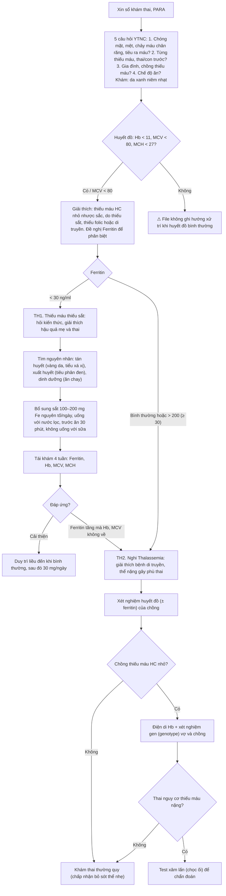
```mermaid
flowchart TD
  A["Xin sổ khám thai, PARA"] --> B["5 câu hỏi YTNC: 1. Chóng mặt, mệt, chảy máu chân răng, tiêu ra máu? 2. Từng thiếu máu, thai/con trước? 3. Gia đình, chồng thiếu máu? 4. Chế độ ăn? Khám: da xanh niêm nhạt"]
  B --> C{"Huyết đồ: Hb < 11, MCV < 80, MCH < 27?"}
  C -->|"Có / MCV < 80"| D["Giải thích: thiếu máu HC nhỏ nhược sắc, do thiếu sắt, thiếu folic hoặc di truyền. Đề nghị Ferritin để phân biệt"]
  C -->|"Không"| C1["⚠ File không ghi hướng xử trí khi huyết đồ bình thường"]
  D --> E{"Ferritin"}
  E -->|"< 30 ng/ml"| F["TH1. Thiếu máu thiếu sắt: hỏi kiến thức, giải thích hậu quả mẹ và thai"]
  F --> F1["Tìm nguyên nhân: tán huyết (vàng da, tiểu xá xị), xuất huyết (tiêu phân đen), dinh dưỡng (ăn chay)"]
  F1 --> F2["Bổ sung sắt 100–200 mg Fe nguyên tố/ngày, uống với nước lọc, trước ăn 30 phút, không uống với sữa"]
  F2 --> F3["Tái khám 4 tuần: Ferritin, Hb, MCV, MCH"]
  F3 --> F4{"Đáp ứng?"}
  F4 -->|"Cải thiện"| F5["Duy trì liều đến khi bình thường, sau đó 30 mg/ngày"]
  F4 -->|"Ferritin tăng mà Hb, MCV không về"| G
  E -->|"Bình thường hoặc > 200 (≥ 30)"| G["TH2. Nghi Thalassemia: giải thích bệnh di truyền, thể nặng gây phù thai"]
  G --> H["Xét nghiệm huyết đồ (± ferritin) của chồng"]
  H --> H1{"Chồng thiếu máu HC nhỏ?"}
  H1 -->|"Không"| H2["Khám thai thường quy (chấp nhận bỏ sót thể nhẹ)"]
  H1 -->|"Có"| I["Điện di Hb + xét nghiệm gen (genotype) vợ và chồng"]
  I --> I1{"Thai nguy cơ thiếu máu nặng?"}
  I1 -->|"Không"| H2
  I1 -->|"Có"| I2["Test xâm lấn (chọc ối) để chẩn đoán"]
```

### 5. Viêm gan B (HBsAg dương)

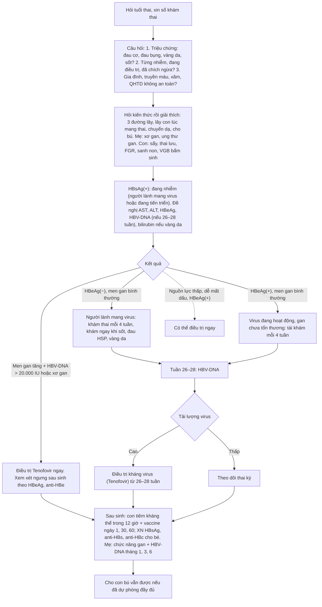
```mermaid
flowchart TD
  A["Hỏi tuổi thai, xin sổ khám thai"] --> B["Câu hỏi: 1. Triệu chứng: đau cơ, đau bụng, vàng da, sốt? 2. Từng nhiễm, đang điều trị, đã chích ngừa? 3. Gia đình, truyền máu, xăm, QHTD không an toàn?"]
  B --> C["Hỏi kiến thức rồi giải thích: 3 đường lây, lây con lúc mang thai, chuyển dạ, cho bú. Mẹ: xơ gan, ung thư gan. Con: sẩy, thai lưu, FGR, sanh non, VGB bẩm sinh"]
  C --> D["HBsAg(+): đang nhiễm (người lành mang virus hoặc đang tiến triển). Đề nghị AST, ALT, HBeAg, HBV-DNA (nếu 26–28 tuần), bilirubin nếu vàng da"]
  D --> E{"Kết quả"}
  E -->|"Men gan tăng + HBV-DNA > 20.000 IU hoặc xơ gan"| F["Điều trị Tenofovir ngay. Xem xét ngưng sau sinh theo HBeAg, anti-HBe"]
  E -->|"HBeAg(−), men gan bình thường"| G["Người lành mang virus: khám thai mỗi 4 tuần, khám ngay khi sốt, đau HSP, vàng da"]
  E -->|"HBeAg(+), men gan bình thường"| H["Virus đang hoạt động, gan chưa tổn thương: tái khám mỗi 4 tuần"]
  G --> I["Tuần 26–28: HBV-DNA"]
  H --> I
  I --> I1{"Tải lượng virus"}
  I1 -->|"Cao"| I2["Điều trị kháng virus (Tenofovir) từ 26–28 tuần"]
  I1 -->|"Thấp"| I3["Theo dõi thai kỳ"]
  F --> J["Sau sinh: con tiêm kháng thể trong 12 giờ + vaccine ngày 1, 30, 60; XN HBsAg, anti-HBs, anti-HBc cho bé. Mẹ: chức năng gan + HBV-DNA tháng 1, 3, 6"]
  I2 --> J
  I3 --> J
  J --> K["Cho con bú vẫn được nếu đã dự phòng đầy đủ"]
  E -.->|"Nguồn lực thấp, dễ mất dấu, HBeAg(+)"| L["Có thể điều trị ngay"]
```

### 6. Giang mai

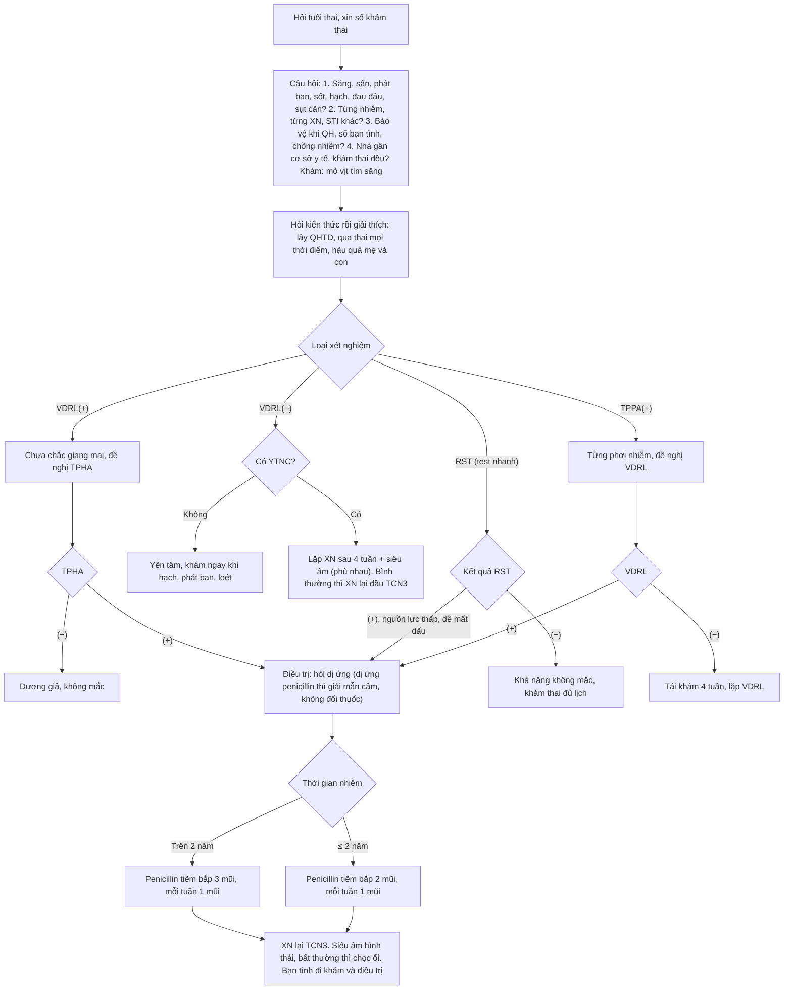
```mermaid
flowchart TD
  A["Hỏi tuổi thai, xin sổ khám thai"] --> B["Câu hỏi: 1. Săng, sẩn, phát ban, sốt, hạch, đau đầu, sụt cân? 2. Từng nhiễm, từng XN, STI khác? 3. Bảo vệ khi QH, số bạn tình, chồng nhiễm? 4. Nhà gần cơ sở y tế, khám thai đều? Khám: mỏ vịt tìm săng"]
  B --> C["Hỏi kiến thức rồi giải thích: lây QHTD, qua thai mọi thời điểm, hậu quả mẹ và con"]
  C --> D{"Loại xét nghiệm"}
  D -->|"VDRL(+)"| E["Chưa chắc giang mai, đề nghị TPHA"]
  E --> E1{"TPHA"}
  E1 -->|"(−)"| E2["Dương giả, không mắc"]
  E1 -->|"(+)"| T
  D -->|"VDRL(−)"| F{"Có YTNC?"}
  F -->|"Không"| F1["Yên tâm, khám ngay khi hạch, phát ban, loét"]
  F -->|"Có"| F2["Lặp XN sau 4 tuần + siêu âm (phù nhau). Bình thường thì XN lại đầu TCN3"]
  D -->|"RST (test nhanh)"| G{"Kết quả RST"}
  G -->|"(−)"| G1["Khả năng không mắc, khám thai đủ lịch"]
  G -->|"(+), nguồn lực thấp, dễ mất dấu"| T
  D -->|"TPPA(+)"| H["Từng phơi nhiễm, đề nghị VDRL"]
  H --> H1{"VDRL"}
  H1 -->|"(−)"| H2["Tái khám 4 tuần, lặp VDRL"]
  H1 -->|"(+)"| T
  T["Điều trị: hỏi dị ứng (dị ứng penicillin thì giải mẫn cảm, không đổi thuốc)"] --> T1{"Thời gian nhiễm"}
  T1 -->|"Trên 2 năm"| T2["Penicillin tiêm bắp 3 mũi, mỗi tuần 1 mũi"]
  T1 -->|"≤ 2 năm"| T3["Penicillin tiêm bắp 2 mũi, mỗi tuần 1 mũi"]
  T2 --> T4["XN lại TCN3. Siêu âm hình thái, bất thường thì chọc ối. Bạn tình đi khám và điều trị"]
  T3 --> T4
```

### 7. Tầm soát lệch bội

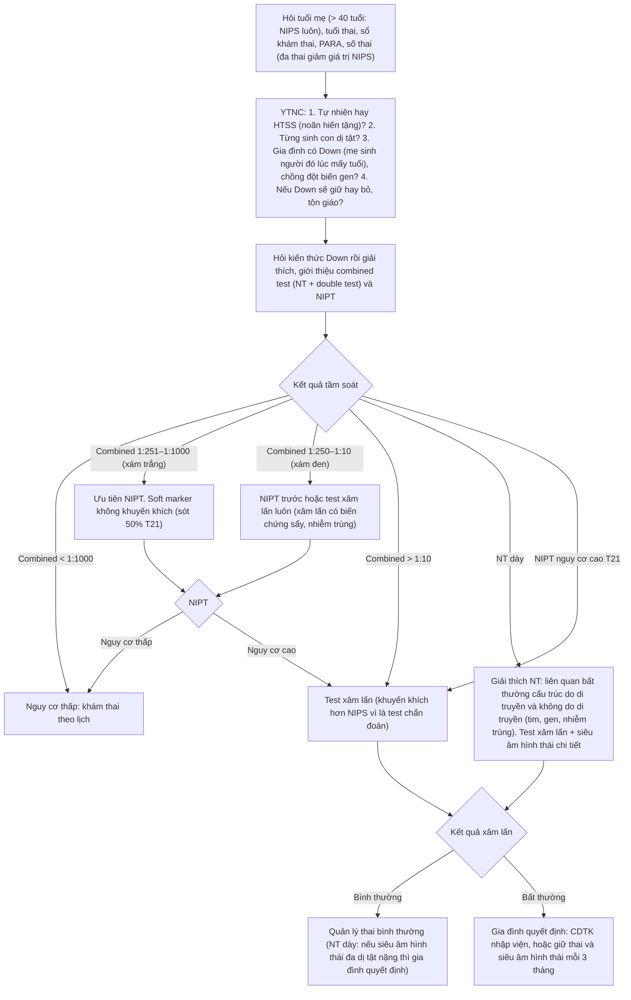
```mermaid
flowchart TD
  A["Hỏi tuổi mẹ (> 40 tuổi: NIPS luôn), tuổi thai, sổ khám thai, PARA, số thai (đa thai giảm giá trị NIPS)"] --> B["YTNC: 1. Tự nhiên hay HTSS (noãn hiến tặng)? 2. Từng sinh con dị tật? 3. Gia đình có Down (mẹ sinh người đó lúc mấy tuổi), chồng đột biến gen? 4. Nếu Down sẽ giữ hay bỏ, tôn giáo?"]
  B --> C["Hỏi kiến thức Down rồi giải thích, giới thiệu combined test (NT + double test) và NIPT"]
  C --> D{"Kết quả tầm soát"}
  D -->|"Combined < 1:1000"| E["Nguy cơ thấp: khám thai theo lịch"]
  D -->|"Combined 1:251–1:1000 (xám trắng)"| F["Ưu tiên NIPT. Soft marker không khuyến khích (sót 50% T21)"]
  D -->|"Combined 1:250–1:10 (xám đen)"| G["NIPT trước hoặc test xâm lấn luôn (xâm lấn có biến chứng sẩy, nhiễm trùng)"]
  D -->|"Combined > 1:10"| H["Test xâm lấn (khuyến khích hơn NIPS vì là test chẩn đoán)"]
  D -->|"NT dày"| I["Giải thích NT: liên quan bất thường cấu trúc do di truyền và không do di truyền (tim, gen, nhiễm trùng). Test xâm lấn + siêu âm hình thái chi tiết"]
  D -->|"NIPT nguy cơ cao T21"| H
  F --> N{"NIPT"}
  G --> N
  N -->|"Nguy cơ thấp"| E
  N -->|"Nguy cơ cao"| H
  H --> X{"Kết quả xâm lấn"}
  I --> X
  X -->|"Bình thường"| X1["Quản lý thai bình thường (NT dày: nếu siêu âm hình thái đa dị tật nặng thì gia đình quyết định)"]
  X -->|"Bất thường"| X2["Gia đình quyết định: CDTK nhập viện, hoặc giữ thai và siêu âm hình thái mỗi 3 tháng"]
```

### 8. HIV (thai phụ hỏi tại sao phải xét nghiệm)

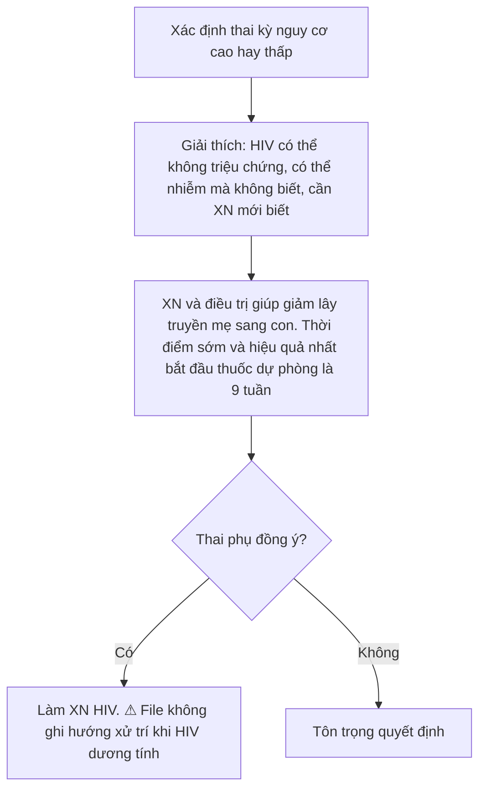
```mermaid
flowchart TD
  A["Xác định thai kỳ nguy cơ cao hay thấp"] --> B["Giải thích: HIV có thể không triệu chứng, có thể nhiễm mà không biết, cần XN mới biết"]
  B --> C["XN và điều trị giúp giảm lây truyền mẹ sang con. Thời điểm sớm và hiệu quả nhất bắt đầu thuốc dự phòng là 9 tuần"]
  C --> D{"Thai phụ đồng ý?"}
  D -->|"Có"| E["Làm XN HIV. ⚠ File không ghi hướng xử trí khi HIV dương tính"]
  D -->|"Không"| F["Tôn trọng quyết định"]
```

### 9. Lên lịch khám thai

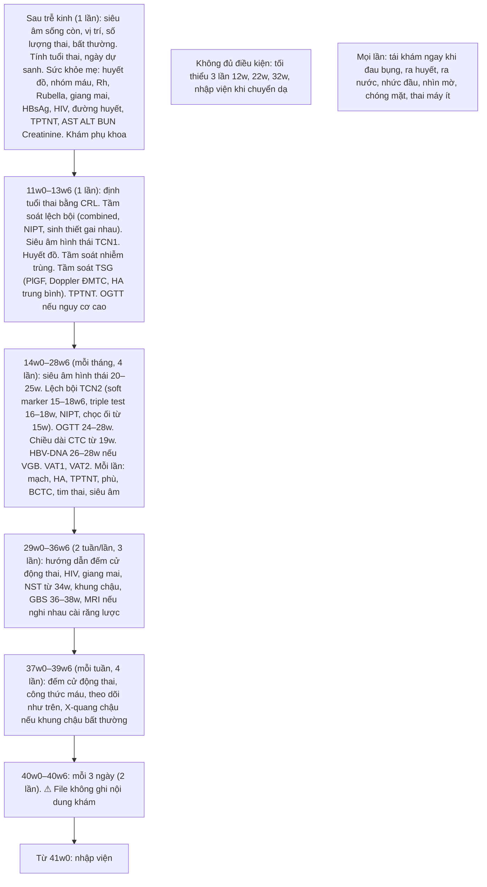
```mermaid
flowchart TD
  A["Sau trễ kinh (1 lần): siêu âm sống còn, vị trí, số lượng thai, bất thường. Tính tuổi thai, ngày dự sanh. Sức khỏe mẹ: huyết đồ, nhóm máu, Rh, Rubella, giang mai, HBsAg, HIV, đường huyết, TPTNT, AST ALT BUN Creatinine. Khám phụ khoa"] --> B["11w0–13w6 (1 lần): định tuổi thai bằng CRL. Tầm soát lệch bội (combined, NIPT, sinh thiết gai nhau). Siêu âm hình thái TCN1. Huyết đồ. Tầm soát nhiễm trùng. Tầm soát TSG (PlGF, Doppler ĐMTC, HA trung bình). TPTNT. OGTT nếu nguy cơ cao"]
  B --> C["14w0–28w6 (mỗi tháng, 4 lần): siêu âm hình thái 20–25w. Lệch bội TCN2 (soft marker 15–18w6, triple test 16–18w, NIPT, chọc ối từ 15w). OGTT 24–28w. Chiều dài CTC từ 19w. HBV-DNA 26–28w nếu VGB. VAT1, VAT2. Mỗi lần: mạch, HA, TPTNT, phù, BCTC, tim thai, siêu âm"]
  C --> D["29w0–36w6 (2 tuần/lần, 3 lần): hướng dẫn đếm cử động thai, HIV, giang mai, NST từ 34w, khung chậu, GBS 36–38w, MRI nếu nghi nhau cài răng lược"]
  D --> E["37w0–39w6 (mỗi tuần, 4 lần): đếm cử động thai, công thức máu, theo dõi như trên, X-quang chậu nếu khung chậu bất thường"]
  E --> F["40w0–40w6: mỗi 3 ngày (2 lần). ⚠ File không ghi nội dung khám"]
  F --> G["Từ 41w0: nhập viện"]
  H["Không đủ điều kiện: tối thiểu 3 lần 12w, 22w, 32w, nhập viện khi chuyển dạ"]
  I["Mọi lần: tái khám ngay khi đau bụng, ra huyết, ra nước, nhức đầu, nhìn mờ, chóng mặt, thai máy ít"]
```

## CHƯƠNG 3: LƯỢNG GIÁ SỨC KHỎE THAI

### 10. Thai giới hạn tăng trưởng (FGR)

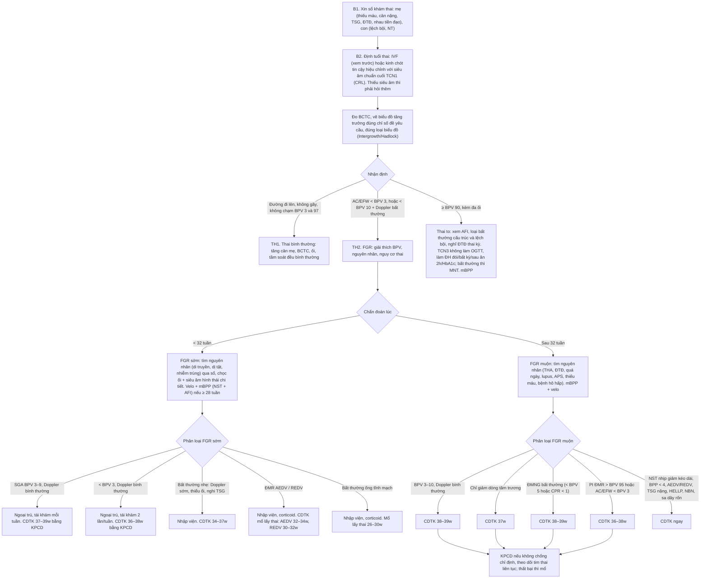
```mermaid
flowchart TD
  A["B1. Xin sổ khám thai: mẹ (thiếu máu, cân nặng, TSG, ĐTĐ, nhau tiền đạo), con (lệch bội, NT)"] --> B["B2. Định tuổi thai: IVF (xem trước) hoặc kinh chót tin cậy hiệu chỉnh với siêu âm chuẩn cuối TCN1 (CRL). Thiếu siêu âm thì phải hỏi thêm"]
  B --> C["Đo BCTC, vẽ biểu đồ tăng trưởng đúng chỉ số đề yêu cầu, đúng loại biểu đồ (Intergrowth/Hadlock)"]
  C --> D{"Nhận định"}
  D -->|"Đường đi lên, không gãy, không chạm BPV 3 và 97"| E["TH1. Thai bình thường: tăng cân mẹ, BCTC, ối, tầm soát đều bình thường"]
  D -->|"AC/EFW < BPV 3, hoặc < BPV 10 + Doppler bất thường"| F["TH2. FGR: giải thích BPV, nguyên nhân, nguy cơ thai"]
  D -->|"≥ BPV 90, kèm đa ối"| G["Thai to: xem AFI, loại bất thường cấu trúc và lệch bội, nghĩ ĐTĐ thai kỳ. TCN3 không làm OGTT, làm ĐH đói/bất kỳ/sau ăn 2h/HbA1c; bất thường thì MNT. mBPP"]
  F --> H{"Chẩn đoán lúc"}
  H -->|"< 32 tuần"| I["FGR sớm: tìm nguyên nhân (di truyền, dị tật, nhiễm trùng) qua sổ, chọc ối + siêu âm hình thái chi tiết. Velo + mBPP (NST + AFI) nếu ≥ 28 tuần"]
  H -->|"Sau 32 tuần"| J["FGR muộn: tìm nguyên nhân (THA, ĐTĐ, quá ngày, lupus, APS, thiếu máu, bệnh hô hấp). mBPP + velo"]
  I --> I1{"Phân loại FGR sớm"}
  I1 -->|"SGA BPV 3–9, Doppler bình thường"| K1["Ngoại trú, tái khám mỗi tuần. CDTK 37–39w bằng KPCD"]
  I1 -->|"< BPV 3, Doppler bình thường"| K2["Ngoại trú, tái khám 2 lần/tuần. CDTK 36–38w bằng KPCD"]
  I1 -->|"Bất thường nhẹ: Doppler sớm, thiểu ối, nghi TSG"| K3["Nhập viện. CDTK 34–37w"]
  I1 -->|"ĐMR AEDV / REDV"| K4["Nhập viện, corticoid. CDTK mổ lấy thai: AEDV 32–34w, REDV 30–32w"]
  I1 -->|"Bất thường ống tĩnh mạch"| K5["Nhập viện, corticoid. Mổ lấy thai 26–30w"]
  J --> J1{"Phân loại FGR muộn"}
  J1 -->|"BPV 3–10, Doppler bình thường"| L1["CDTK 38–39w"]
  J1 -->|"Chỉ giảm dòng tâm trương"| L2["CDTK 37w"]
  J1 -->|"ĐMNG bất thường (< BPV 5 hoặc CPR < 1)"| L3["CDTK 38–39w"]
  J1 -->|"PI ĐMR > BPV 95 hoặc AC/EFW < BPV 3"| L4["CDTK 36–38w"]
  J1 -->|"NST nhịp giảm kéo dài, BPP < 4, AEDV/REDV, TSG nặng, HELLP, NBN, sa dây rốn"| L5["CDTK ngay"]
  L1 --> M["KPCD nếu không chống chỉ định, theo dõi tim thai liên tục; thất bại thì mổ"]
  L2 --> M
  L3 --> M
  L4 --> M
```

### 11. Giảm cử động thai

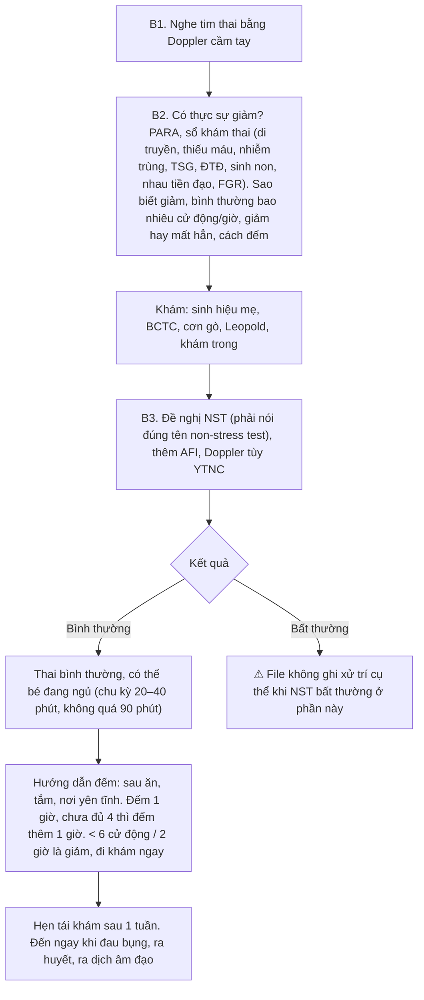
```mermaid
flowchart TD
  A["B1. Nghe tim thai bằng Doppler cầm tay"] --> B["B2. Có thực sự giảm? PARA, sổ khám thai (di truyền, thiếu máu, nhiễm trùng, TSG, ĐTĐ, sinh non, nhau tiền đạo, FGR). Sao biết giảm, bình thường bao nhiêu cử động/giờ, giảm hay mất hẳn, cách đếm"]
  B --> C["Khám: sinh hiệu mẹ, BCTC, cơn gò, Leopold, khám trong"]
  C --> D["B3. Đề nghị NST (phải nói đúng tên non-stress test), thêm AFI, Doppler tùy YTNC"]
  D --> E{"Kết quả"}
  E -->|"Bình thường"| F["Thai bình thường, có thể bé đang ngủ (chu kỳ 20–40 phút, không quá 90 phút)"]
  F --> G["Hướng dẫn đếm: sau ăn, tắm, nơi yên tĩnh. Đếm 1 giờ, chưa đủ 4 thì đếm thêm 1 giờ. < 6 cử động / 2 giờ là giảm, đi khám ngay"]
  G --> H["Hẹn tái khám sau 1 tuần. Đến ngay khi đau bụng, ra huyết, ra dịch âm đạo"]
  E -->|"Bất thường"| I["⚠ File không ghi xử trí cụ thể khi NST bất thường ở phần này"]
```

### 12. Quá ngày dự sinh

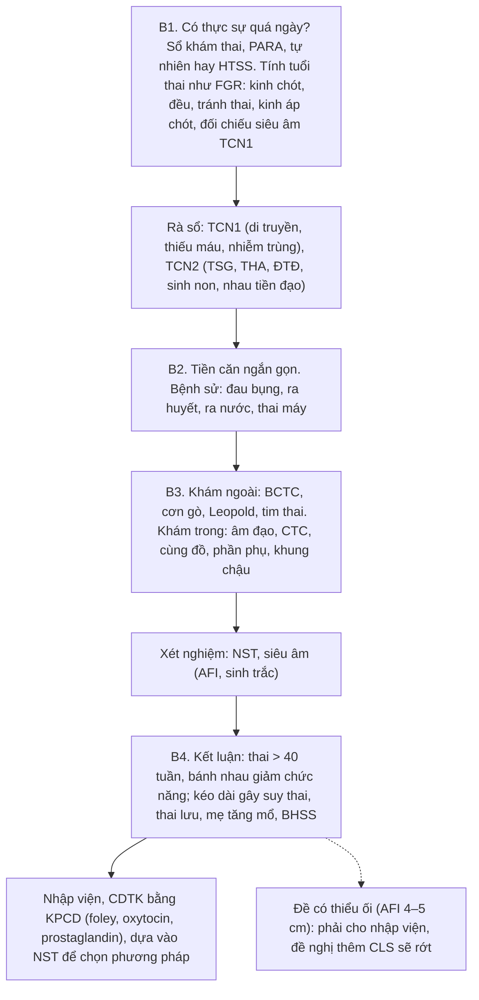
```mermaid
flowchart TD
  A["B1. Có thực sự quá ngày? Sổ khám thai, PARA, tự nhiên hay HTSS. Tính tuổi thai như FGR: kinh chót, đều, tránh thai, kinh áp chót, đối chiếu siêu âm TCN1"] --> B["Rà sổ: TCN1 (di truyền, thiếu máu, nhiễm trùng), TCN2 (TSG, THA, ĐTĐ, sinh non, nhau tiền đạo)"]
  B --> C["B2. Tiền căn ngắn gọn. Bệnh sử: đau bụng, ra huyết, ra nước, thai máy"]
  C --> D["B3. Khám ngoài: BCTC, cơn gò, Leopold, tim thai. Khám trong: âm đạo, CTC, cùng đồ, phần phụ, khung chậu"]
  D --> E["Xét nghiệm: NST, siêu âm (AFI, sinh trắc)"]
  E --> F["B4. Kết luận: thai > 40 tuần, bánh nhau giảm chức năng; kéo dài gây suy thai, thai lưu, mẹ tăng mổ, BHSS"]
  F --> G["Nhập viện, CDTK bằng KPCD (foley, oxytocin, prostaglandin), dựa vào NST để chọn phương pháp"]
  F -.-> H["Đề có thiểu ối (AFI 4–5 cm): phải cho nhập viện, đề nghị thêm CLS sẽ rớt"]
```

## CHƯƠNG 4: NỬA SAU THAI KỲ

### 13. Đái tháo đường thai kỳ

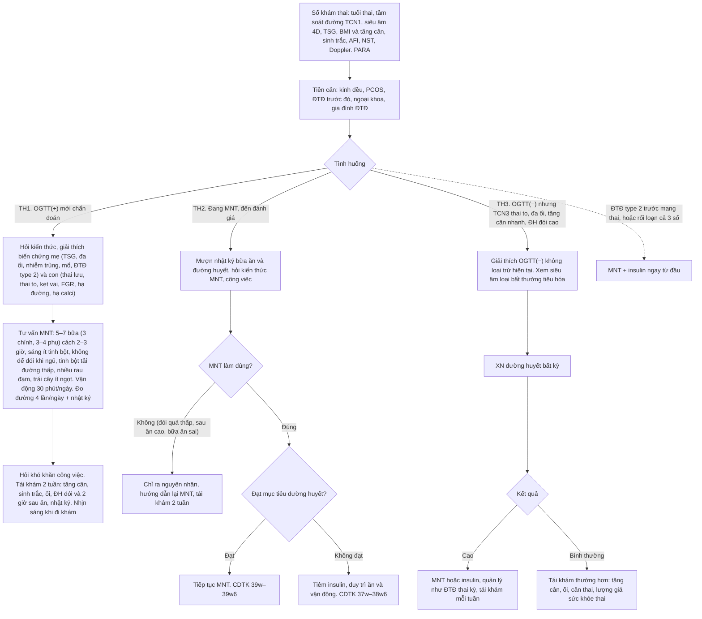
```mermaid
flowchart TD
  A["Sổ khám thai: tuổi thai, tầm soát đường TCN1, siêu âm 4D, TSG, BMI và tăng cân, sinh trắc, AFI, NST, Doppler. PARA"] --> B["Tiền căn: kinh đều, PCOS, ĐTĐ trước đó, ngoại khoa, gia đình ĐTĐ"]
  B --> C{"Tình huống"}
  C -->|"TH1. OGTT(+) mới chẩn đoán"| D["Hỏi kiến thức, giải thích biến chứng mẹ (TSG, đa ối, nhiễm trùng, mổ, ĐTĐ type 2) và con (thai lưu, thai to, kẹt vai, FGR, hạ đường, hạ calci)"]
  D --> E["Tư vấn MNT: 5–7 bữa (3 chính, 3–4 phụ) cách 2–3 giờ, sáng ít tinh bột, không để đói khi ngủ, tinh bột tải đường thấp, nhiều rau đạm, trái cây ít ngọt. Vận động 30 phút/ngày. Đo đường 4 lần/ngày + nhật ký"]
  E --> F["Hỏi khó khăn công việc. Tái khám 2 tuần: tăng cân, sinh trắc, ối, ĐH đói và 2 giờ sau ăn, nhật ký. Nhịn sáng khi đi khám"]
  C -->|"TH2. Đang MNT, đến đánh giá"| G["Mượn nhật ký bữa ăn và đường huyết, hỏi kiến thức MNT, công việc"]
  G --> H{"MNT làm đúng?"}
  H -->|"Không (đói quá thấp, sau ăn cao, bữa ăn sai)"| I["Chỉ ra nguyên nhân, hướng dẫn lại MNT, tái khám 2 tuần"]
  H -->|"Đúng"| J{"Đạt mục tiêu đường huyết?"}
  J -->|"Đạt"| K["Tiếp tục MNT. CDTK 39w–39w6"]
  J -->|"Không đạt"| L["Tiêm insulin, duy trì ăn và vận động. CDTK 37w–38w6"]
  C -->|"TH3. OGTT(−) nhưng TCN3 thai to, đa ối, tăng cân nhanh, ĐH đói cao"| M["Giải thích OGTT(−) không loại trừ hiện tại. Xem siêu âm loại bất thường tiêu hóa"]
  M --> N["XN đường huyết bất kỳ"]
  N --> N1{"Kết quả"}
  N1 -->|"Cao"| N2["MNT hoặc insulin, quản lý như ĐTĐ thai kỳ, tái khám mỗi tuần"]
  N1 -->|"Bình thường"| N3["Tái khám thường hơn: tăng cân, ối, cân thai, lượng giá sức khỏe thai"]
  C -.->|"ĐTĐ type 2 trước mang thai, hoặc rối loạn cả 3 số"| O["MNT + insulin ngay từ đầu"]
```

### 14. Tiền sản giật

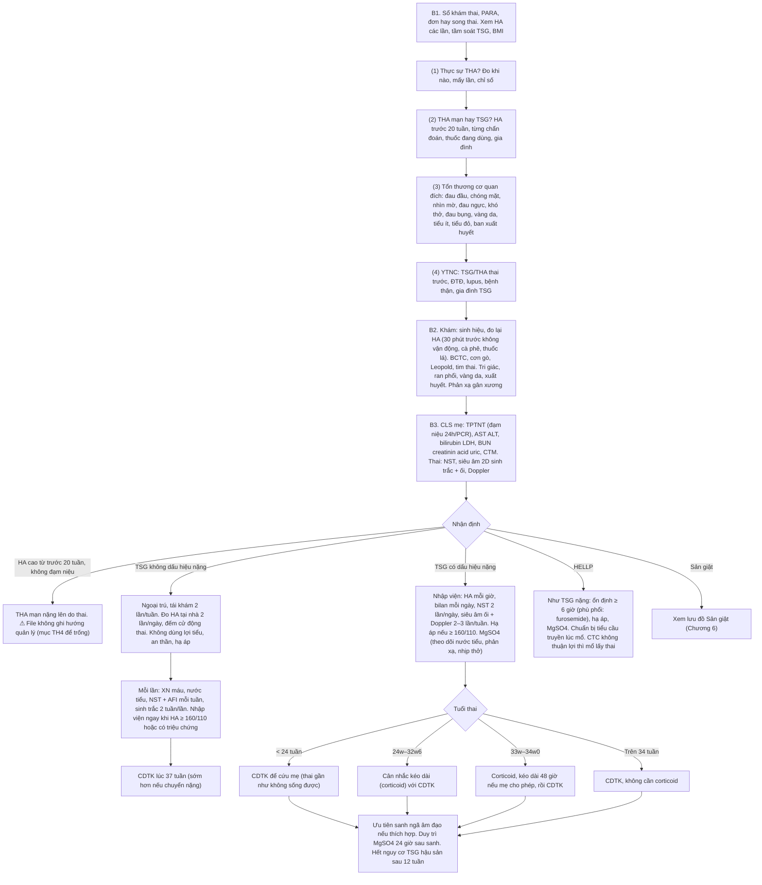
```mermaid
flowchart TD
  A["B1. Sổ khám thai, PARA, đơn hay song thai. Xem HA các lần, tầm soát TSG, BMI"] --> B["(1) Thực sự THA? Đo khi nào, mấy lần, chỉ số"]
  B --> C["(2) THA mạn hay TSG? HA trước 20 tuần, từng chẩn đoán, thuốc đang dùng, gia đình"]
  C --> D["(3) Tổn thương cơ quan đích: đau đầu, chóng mặt, nhìn mờ, đau ngực, khó thở, đau bụng, vàng da, tiểu ít, tiểu đỏ, ban xuất huyết"]
  D --> E["(4) YTNC: TSG/THA thai trước, ĐTĐ, lupus, bệnh thận, gia đình TSG"]
  E --> F["B2. Khám: sinh hiệu, đo lại HA (30 phút trước không vận động, cà phê, thuốc lá). BCTC, cơn gò, Leopold, tim thai. Tri giác, ran phổi, vàng da, xuất huyết. Phản xạ gân xương"]
  F --> G["B3. CLS mẹ: TPTNT (đạm niệu 24h/PCR), AST ALT, bilirubin LDH, BUN creatinin acid uric, CTM. Thai: NST, siêu âm 2D sinh trắc + ối, Doppler"]
  G --> H{"Nhận định"}
  H -->|"HA cao từ trước 20 tuần, không đạm niệu"| H0["THA mạn nặng lên do thai. ⚠ File không ghi hướng quản lý (mục TH4 để trống)"]
  H -->|"TSG không dấu hiệu nặng"| I["Ngoại trú, tái khám 2 lần/tuần. Đo HA tại nhà 2 lần/ngày, đếm cử động thai. Không dùng lợi tiểu, an thần, hạ áp"]
  I --> I1["Mỗi lần: XN máu, nước tiểu, NST + AFI mỗi tuần, sinh trắc 2 tuần/lần. Nhập viện ngay khi HA ≥ 160/110 hoặc có triệu chứng"]
  I1 --> I2["CDTK lúc 37 tuần (sớm hơn nếu chuyển nặng)"]
  H -->|"TSG có dấu hiệu nặng"| J["Nhập viện: HA mỗi giờ, bilan mỗi ngày, NST 2 lần/ngày, siêu âm ối + Doppler 2–3 lần/tuần. Hạ áp nếu ≥ 160/110. MgSO4 (theo dõi nước tiểu, phản xạ, nhịp thở)"]
  J --> K{"Tuổi thai"}
  K -->|"< 24 tuần"| K1["CDTK để cứu mẹ (thai gần như không sống được)"]
  K -->|"24w–32w6"| K2["Cân nhắc kéo dài (corticoid) với CDTK"]
  K -->|"33w–34w0"| K3["Corticoid, kéo dài 48 giờ nếu mẹ cho phép, rồi CDTK"]
  K -->|"Trên 34 tuần"| K4["CDTK, không cần corticoid"]
  K1 --> L["Ưu tiên sanh ngã âm đạo nếu thích hợp. Duy trì MgSO4 24 giờ sau sanh. Hết nguy cơ TSG hậu sản sau 12 tuần"]
  K2 --> L
  K3 --> L
  K4 --> L
  H -->|"HELLP"| M["Như TSG nặng: ổn định ≥ 6 giờ (phù phổi: furosemide), hạ áp, MgSO4. Chuẩn bị tiểu cầu truyền lúc mổ. CTC không thuận lợi thì mổ lấy thai"]
  H -->|"Sản giật"| N["Xem lưu đồ Sản giật (Chương 6)"]
```

### 15. Dọa sinh non / chuyển dạ sinh non

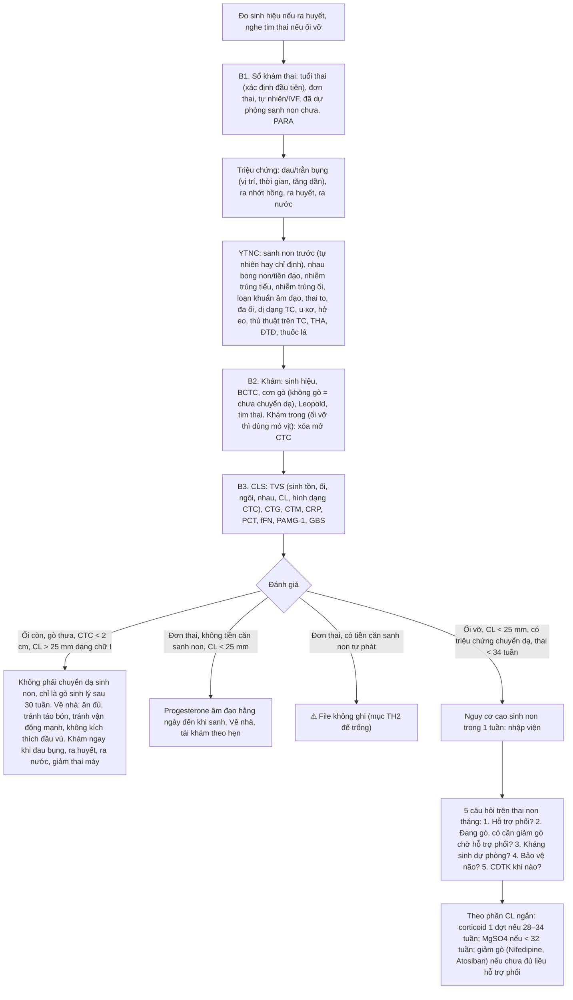
```mermaid
flowchart TD
  A["Đo sinh hiệu nếu ra huyết, nghe tim thai nếu ối vỡ"] --> B["B1. Sổ khám thai: tuổi thai (xác định đầu tiên), đơn thai, tự nhiên/IVF, đã dự phòng sanh non chưa. PARA"]
  B --> C["Triệu chứng: đau/trằn bụng (vị trí, thời gian, tăng dần), ra nhớt hồng, ra huyết, ra nước"]
  C --> D["YTNC: sanh non trước (tự nhiên hay chỉ định), nhau bong non/tiền đạo, nhiễm trùng tiểu, nhiễm trùng ối, loạn khuẩn âm đạo, thai to, đa ối, dị dạng TC, u xơ, hở eo, thủ thuật trên TC, THA, ĐTĐ, thuốc lá"]
  D --> E["B2. Khám: sinh hiệu, BCTC, cơn gò (không gò = chưa chuyển dạ), Leopold, tim thai. Khám trong (ối vỡ thì dùng mỏ vịt): xóa mở CTC"]
  E --> F["B3. CLS: TVS (sinh tồn, ối, ngôi, nhau, CL, hình dạng CTC), CTG, CTM, CRP, PCT, fFN, PAMG-1, GBS"]
  F --> G{"Đánh giá"}
  G -->|"Ối còn, gò thưa, CTC < 2 cm, CL > 25 mm dạng chữ I"| H["Không phải chuyển dạ sinh non, chỉ là gò sinh lý sau 30 tuần. Về nhà: ăn đủ, tránh táo bón, tránh vận động mạnh, không kích thích đầu vú. Khám ngay khi đau bụng, ra huyết, ra nước, giảm thai máy"]
  G -->|"Đơn thai, không tiền căn sanh non, CL < 25 mm"| I["Progesterone âm đạo hằng ngày đến khi sanh. Về nhà, tái khám theo hẹn"]
  G -->|"Đơn thai, có tiền căn sanh non tự phát"| I2["⚠ File không ghi (mục TH2 để trống)"]
  G -->|"Ối vỡ, CL < 25 mm, có triệu chứng chuyển dạ, thai < 34 tuần"| J["Nguy cơ cao sinh non trong 1 tuần: nhập viện"]
  J --> K["5 câu hỏi trên thai non tháng: 1. Hỗ trợ phổi? 2. Đang gò, có cần giảm gò chờ hỗ trợ phổi? 3. Kháng sinh dự phòng? 4. Bảo vệ não? 5. CDTK khi nào?"]
  K --> K1["Theo phần CL ngắn: corticoid 1 đợt nếu 28–34 tuần; MgSO4 nếu < 32 tuần; giảm gò (Nifedipine, Atosiban) nếu chưa đủ liều hỗ trợ phổi"]
```

### 16. Chiều dài kênh cổ tử cung (CL) ngắn

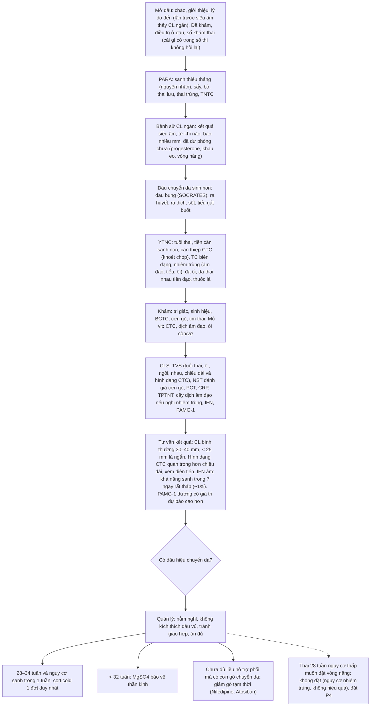
```mermaid
flowchart TD
  A["Mở đầu: chào, giới thiệu, lý do đến (lần trước siêu âm thấy CL ngắn). Đã khám, điều trị ở đâu, sổ khám thai (cái gì có trong sổ thì không hỏi lại)"] --> B["PARA: sanh thiếu tháng (nguyên nhân), sẩy, bỏ, thai lưu, thai trứng, TNTC"]
  B --> C["Bệnh sử CL ngắn: kết quả siêu âm, từ khi nào, bao nhiêu mm, đã dự phòng chưa (progesterone, khâu eo, vòng nâng)"]
  C --> D["Dấu chuyển dạ sinh non: đau bụng (SOCRATES), ra huyết, ra dịch, sốt, tiểu gắt buốt"]
  D --> E["YTNC: tuổi thai, tiền căn sanh non, can thiệp CTC (khoét chóp), TC biến dạng, nhiễm trùng (âm đạo, tiểu, ối), đa ối, đa thai, nhau tiền đạo, thuốc lá"]
  E --> F["Khám: tri giác, sinh hiệu, BCTC, cơn gò, tim thai. Mỏ vịt: CTC, dịch âm đạo, ối còn/vỡ"]
  F --> G["CLS: TVS (tuổi thai, ối, ngôi, nhau, chiều dài và hình dạng CTC), NST đánh giá cơn gò, PCT, CRP, TPTNT, cấy dịch âm đạo nếu nghi nhiễm trùng, fFN, PAMG-1"]
  G --> H["Tư vấn kết quả: CL bình thường 30–40 mm, < 25 mm là ngắn. Hình dạng CTC quan trọng hơn chiều dài, xem diễn tiến. fFN âm: khả năng sanh trong 7 ngày rất thấp (~1%). PAMG-1 dương có giá trị dự báo cao hơn"]
  H --> I{"Có dấu hiệu chuyển dạ?"}
  I --> J["Quản lý: nằm nghỉ, không kích thích đầu vú, tránh giao hợp, ăn đủ"]
  J --> K["28–34 tuần và nguy cơ sanh trong 1 tuần: corticoid 1 đợt duy nhất"]
  J --> L["< 32 tuần: MgSO4 bảo vệ thần kinh"]
  J --> M["Chưa đủ liều hỗ trợ phổi mà có cơn gò chuyển dạ: giảm gò tạm thời (Nifedipine, Atosiban)"]
  J -.-> N["Thai 28 tuần nguy cơ thấp muốn đặt vòng nâng: không đặt (nguy cơ nhiễm trùng, không hiệu quả), đặt P4"]
```

### 17. Ối vỡ non

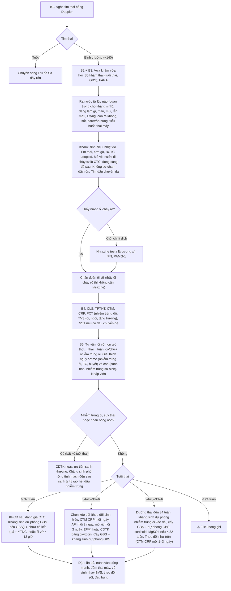
```mermaid
flowchart TD
  A["B1. Nghe tim thai bằng Doppler"] --> A1{"Tim thai"}
  A1 -->|"Tuột"| A2["Chuyển sang lưu đồ Sa dây rốn"]
  A1 -->|"Bình thường (~140)"| B["B2 + B3. Vừa khám vừa hỏi. Sổ khám thai (tuổi thai, GBS), PARA"]
  B --> C["Ra nước từ lúc nào (quan trọng cho kháng sinh), đang làm gì, màu, mùi, lẫn máu, lượng, còn ra không, sốt, đau/trằn bụng, tiểu buốt, thai máy"]
  C --> D["Khám: sinh hiệu, nhiệt độ. Tim thai, cơn gò, BCTC, Leopold. Mỏ vịt: nước ối chảy từ lỗ CTC, đọng cùng đồ sau. Không sờ chạm dây rốn. Tìm dấu chuyển dạ"]
  D --> D1{"Thấy nước ối chảy rõ?"}
  D1 -->|"Có"| E["Chẩn đoán ối vỡ (thấy ối chảy rõ thì không cần nitrazine)"]
  D1 -->|"Khô, chỉ ít dịch"| D2["Nitrazine test / lá dương xỉ, fFN, PAMG-1"]
  D2 --> E
  E --> F["B4. CLS: TPTNT, CTM, CRP, PCT (nhiễm trùng ối), TVS (ối, ngôi, tăng trưởng), NST nếu có dấu chuyển dạ"]
  F --> G["B5. Tư vấn: ối vỡ non giờ thứ..., thai... tuần, có/chưa nhiễm trùng ối. Giải thích nguy cơ mẹ (nhiễm trùng ối, TC, huyết) và con (sanh non, nhiễm trùng sơ sinh). Nhập viện"]
  G --> H{"Nhiễm trùng ối, suy thai hoặc nhau bong non?"}
  H -->|"Có (bất kể tuổi thai)"| H1["CDTK ngay, ưu tiên sanh thường. Kháng sinh phổ rộng tĩnh mạch đến sau sanh ≥ 48 giờ hết dấu nhiễm trùng"]
  H -->|"Không"| I{"Tuổi thai"}
  I -->|"≥ 37 tuần"| I1["KPCD sau đánh giá CTC. Kháng sinh dự phòng GBS nếu GBS(+), chưa có kết quả + YTNC, hoặc ối vỡ > 12 giờ"]
  I -->|"34w0–36w6"| I2["Chọn kéo dài (theo dõi sinh hiệu, CTM CRP mỗi ngày, AFI mỗi 2 ngày, mỏ vịt mỗi 3 ngày, EFM) hoặc CDTK bằng oxytocin. Cấy GBS + kháng sinh dự phòng GBS"]
  I -->|"24w0–33w6"| I3["Dưỡng thai đến 34 tuần: kháng sinh dự phòng nhiễm trùng ối kéo dài, cấy GBS + dự phòng GBS, corticoid, MgSO4 nếu < 32 tuần. Theo dõi như trên (CTM CRP mỗi 1–3 ngày)"]
  I -->|"< 24 tuần"| I4["⚠ File không ghi"]
  I1 --> J["Dặn: ăn đủ, tránh vận động mạnh, đếm thai máy, vệ sinh, thay BVS, theo dõi sốt, đau bụng"]
  I2 --> J
  I3 --> J
```

## CHƯƠNG 5: QUẢN LÝ MỘT CUỘC CHUYỂN DẠ

### 18. Đọc sản đồ + CTG và xử trí chuyển dạ

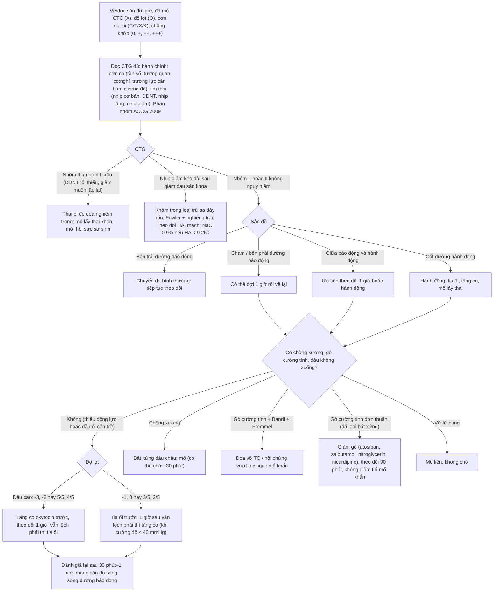
```mermaid
flowchart TD
  A["Vẽ/đọc sản đồ: giờ, độ mở CTC (X), độ lọt (O), cơn co, ối (C/T/X/K), chồng khớp (0, +, ++, +++)"] --> B["Đọc CTG đủ: hành chính; cơn co (tần số, tương quan co:nghỉ, trương lực căn bản, cường độ); tim thai (nhịp cơ bản, DĐNT, nhịp tăng, nhịp giảm). Phân nhóm ACOG 2009"]
  B --> C{"CTG"}
  C -->|"Nhóm III / nhóm II xấu (DĐNT tối thiểu, giảm muộn lặp lại)"| C1["Thai bị đe dọa nghiêm trọng: mổ lấy thai khẩn, mời hồi sức sơ sinh"]
  C -->|"Nhịp giảm kéo dài sau giảm đau sản khoa"| C2["Khám trong loại trừ sa dây rốn. Fowler + nghiêng trái. Theo dõi HA, mạch; NaCl 0,9% nếu HA < 90/60"]
  C -->|"Nhóm I, hoặc II không nguy hiểm"| D{"Sản đồ"}
  D -->|"Bên trái đường báo động"| D1["Chuyển dạ bình thường: tiếp tục theo dõi"]
  D -->|"Chạm / bên phải đường báo động"| D2["Có thể đợi 1 giờ rồi vẽ lại"]
  D -->|"Giữa báo động và hành động"| D3["Ưu tiên theo dõi 1 giờ hoặc hành động"]
  D -->|"Cắt đường hành động"| E["Hành động: tia ối, tăng co, mổ lấy thai"]
  D2 --> F{"Có chồng xương, gò cường tính, đầu không xuống?"}
  D3 --> F
  E --> F
  F -->|"Không (thiếu động lực hoặc đầu ối cản trở)"| G{"Độ lọt"}
  G -->|"Đầu cao: -3, -2 hay 5/5, 4/5"| G1["Tăng co oxytocin trước, theo dõi 1 giờ, vẫn lệch phải thì tia ối"]
  G -->|"-1, 0 hay 3/5, 2/5"| G2["Tia ối trước, 1 giờ sau vẫn lệch phải thì tăng co (khi cường độ < 40 mmHg)"]
  F -->|"Chồng xương"| H["Bất xứng đầu chậu: mổ (có thể chờ ~30 phút)"]
  F -->|"Gò cường tính + Bandl + Frommel"| H2["Dọa vỡ TC / hội chứng vượt trở ngại: mổ khẩn"]
  F -->|"Gò cường tính đơn thuần (đã loại bất xứng)"| H3["Giảm gò (atosiban, salbutamol, nitroglycerin, nicardipine), theo dõi 90 phút, không giảm thì mổ khẩn"]
  F -->|"Vỡ tử cung"| H4["Mổ liền, không chờ"]
  G1 --> I["Đánh giá lại sau 30 phút–1 giờ, mong sản đồ song song đường báo động"]
  G2 --> I
```

## CHƯƠNG 6: CẤP CỨU SẢN KHOA

### 19. Băng huyết sau sinh

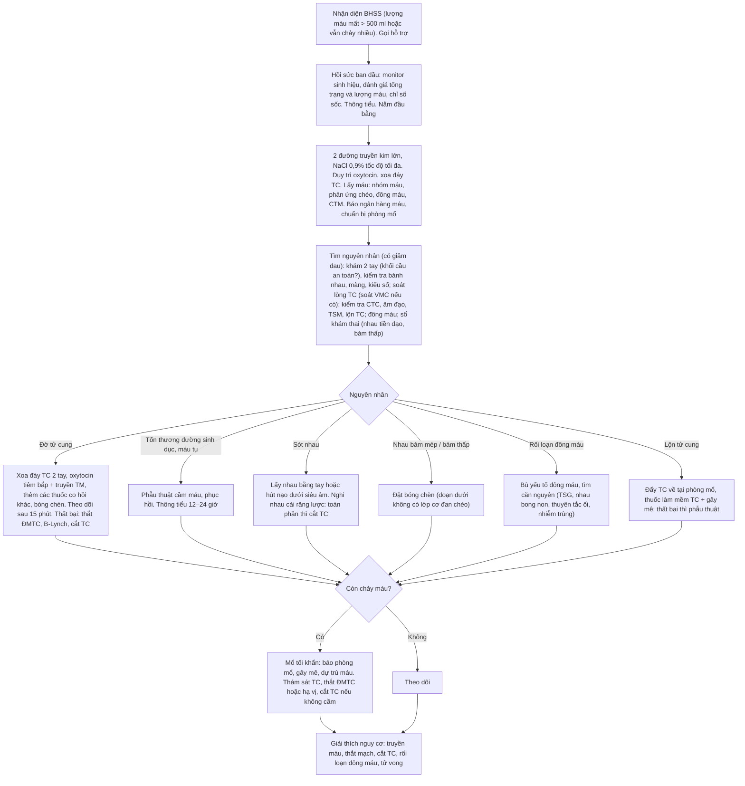
```mermaid
flowchart TD
  A["Nhận diện BHSS (lượng máu mất > 500 ml hoặc vẫn chảy nhiều). Gọi hỗ trợ"] --> B["Hồi sức ban đầu: monitor sinh hiệu, đánh giá tổng trạng và lượng máu, chỉ số sốc. Thông tiểu. Nằm đầu bằng"]
  B --> C["2 đường truyền kim lớn, NaCl 0,9% tốc độ tối đa. Duy trì oxytocin, xoa đáy TC. Lấy máu: nhóm máu, phản ứng chéo, đông máu, CTM. Báo ngân hàng máu, chuẩn bị phòng mổ"]
  C --> D["Tìm nguyên nhân (có giảm đau): khám 2 tay (khối cầu an toàn?), kiểm tra bánh nhau, màng, kiểu sổ; soát lòng TC (soát VMC nếu có); kiểm tra CTC, âm đạo, TSM, lộn TC; đông máu; sổ khám thai (nhau tiền đạo, bám thấp)"]
  D --> E{"Nguyên nhân"}
  E -->|"Đờ tử cung"| E1["Xoa đáy TC 2 tay, oxytocin tiêm bắp + truyền TM, thêm các thuốc co hồi khác, bóng chèn. Theo dõi sau 15 phút. Thất bại: thắt ĐMTC, B-Lynch, cắt TC"]
  E -->|"Tổn thương đường sinh dục, máu tụ"| E2["Phẫu thuật cầm máu, phục hồi. Thông tiểu 12–24 giờ"]
  E -->|"Sót nhau"| E3["Lấy nhau bằng tay hoặc hút nạo dưới siêu âm. Nghi nhau cài răng lược: toàn phần thì cắt TC"]
  E -->|"Nhau bám mép / bám thấp"| E4["Đặt bóng chèn (đoạn dưới không có lớp cơ đan chéo)"]
  E -->|"Rối loạn đông máu"| E5["Bù yếu tố đông máu, tìm căn nguyên (TSG, nhau bong non, thuyên tắc ối, nhiễm trùng)"]
  E -->|"Lộn tử cung"| E6["Đẩy TC về tại phòng mổ, thuốc làm mềm TC + gây mê; thất bại thì phẫu thuật"]
  E1 --> F{"Còn chảy máu?"}
  E2 --> F
  E3 --> F
  E4 --> F
  E5 --> F
  E6 --> F
  F -->|"Có"| G["Mổ tối khẩn: báo phòng mổ, gây mê, dự trù máu. Thám sát TC, thắt ĐMTC hoặc hạ vị, cắt TC nếu không cầm"]
  F -->|"Không"| H["Theo dõi"]
  G --> I["Giải thích nguy cơ: truyền máu, thắt mạch, cắt TC, rối loạn đông máu, tử vong"]
  H --> I
```

### 20. Thử thách sinh ngả âm đạo sau mổ lấy thai (TOLAC)

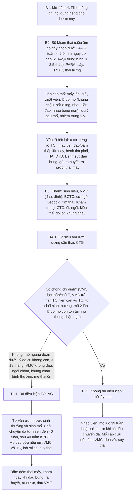
```mermaid
flowchart TD
  A["B1. Mở đầu. ⚠ File không ghi nội dung riêng cho bước này"] --> B["B2. Sổ khám thai (siêu âm độ dày đoạn dưới 34–39 tuần: < 2,0 mm nguy cơ cao, 2,0–2,4 trung bình, ≥ 2,5 thấp). PARA, sẩy, TNTC, thai trứng"]
  B --> C["Tiền căn mổ: mấy lần, giấy xuất viện, lý do mổ (khung chậu, bất xứng, nhau tiền đạo, nhau bong non), lưu ý sau mổ, nhiễm trùng VMC"]
  C --> D["Yếu tố bất lợi: u xơ, từng vỡ TC, nhau tiền đạo/bám thấp lần này, bệnh tim phổi, THA, ĐTĐ. Bệnh sử: đau bụng, gò, ra huyết, ra nước, thai máy"]
  D --> E["B3. Khám: sinh hiệu, VMC (đau, dính), BCTC, cơn gò, Leopold, tim thai. Khám trong: CTC, ối, ngôi, kiểu thế, độ lọt, khung chậu"]
  E --> F["B4. CLS: siêu âm ước lượng cân thai, CTG"]
  F --> G{"Có chống chỉ định? (VMC dọc thân/chữ T, VMC trên thân TC, tiền căn vỡ TC, từ chối sinh thường, mổ 2 lần, lý do mổ còn tồn tại như khung chậu hẹp)"}
  G -->|"Không: mổ ngang đoạn dưới, lý do cũ không còn, > 18 tháng, VMC không đau, ngôi chỏm, khung chậu bình thường, mẹ thai ổn"| H["TH1. Đủ điều kiện TOLAC"]
  H --> H1["Tư vấn ưu, nhược sinh thường và sinh mổ. Chờ chuyển dạ tự nhiên đến 40 tuần, sau 40 tuần KPCD. Mổ cấp cứu nếu nứt VMC, vỡ TC, bất xứng, suy thai"]
  H1 --> H2["Dặn: đếm thai máy, khám ngay khi đau bụng, ra huyết, ra nước, đau VMC"]
  G -->|"Có"| I["TH2. Không đủ điều kiện: mổ lấy thai"]
  I --> I1["Nhập viện, mổ lúc 39 tuần hoặc sớm hơn khi có dấu chuyển dạ. Mổ cấp cứu nếu đau VMC, dọa vỡ, suy thai"]
```

### 21. Sa dây rốn

```mermaid
flowchart TD
  A["Ối vỡ: B1. Nghe tim thai, đọc CTG"] --> B{"Tim thai tuột?"}
  B -->|"Không"| B1["Chuyển sang tiếp cận ối vỡ non (khám bằng mỏ vịt)"]
  B -->|"Có"| C["B2. Khám trong"]
  C --> D{"Có dây rốn?"}
  D -->|"Không"| D1["⚠ File không ghi hướng tiếp theo"]
  D -->|"Có"| E["La gọi hỗ trợ. Đánh giá xóa mở CTC, ngôi, khung chậu: sinh ngả âm đạo lập tức được không"]
  E --> F["B3. Giữ tay trong âm đạo đẩy đầu thai lên. Sản phụ tư thế chổng mông, kê gối dưới mặt"]
  F --> G["Báo hộ sinh: mổ lấy thai thượng khẩn, gọi gây mê hồi sức, nhi sơ sinh"]
  G --> H["B4. Hộ sinh nghe tim thai liên tục đến khi mổ"]
  H --> I["B5. Tư vấn sản phụ và người nhà: cấp cứu nguy hiểm cho thai, phải mổ. Nguy cơ mẹ (mổ, gây mê, vỡ TC, mổ lần sau) và con (tử vong) vẫn còn dù mổ"]
```

### 22. Ra huyết âm đạo nhiều 3 tháng cuối (cấp cứu)

```mermaid
flowchart TD
  A["Gọi người hỗ trợ"] --> B["B1. Đo sinh hiệu mẹ"]
  B --> C{"Sinh hiệu ổn?"}
  C -->|"Không"| C1["Đánh giá máu mất. 2 đường truyền (1 máu, 1 NaCl 0,9%). CTM, đông máu, phản ứng chéo, dự trù máu"]
  C -->|"Có"| D
  C1 --> D["B2. Tim thai (sinh tồn thai), hỏi tuổi thai. Bắt cơn gò, khám bụng ngoại khoa"]
  D --> E{"Cơn gò"}
  E -->|"Mất cơn gò"| F["Lưu đồ Vỡ tử cung"]
  E -->|"Cường tính"| G["Lưu đồ Nhau bong non"]
  E -->|"Bình thường"| H["B3. Hỏi ra huyết: từ khi nào, đang làm gì, lượng, màu, máu cục, từng nhập viện vì ra huyết. Đau bụng: vị trí, liên tục hay từng cơn. Tiền căn nội ngoại"]
  H --> I["Xin siêu âm gần nhất: vị trí bánh nhau, nhau cài răng lược"]
  I --> J{"Nhau tiền đạo?"}
  J -->|"Có"| K["Lưu đồ Nhau tiền đạo"]
  J -->|"Không"| L["⚠ File không ghi"]
```

### 23. Nhau tiền đạo

```mermaid
flowchart TD
  A["B1. Mở đầu. B2. Sổ khám thai (tuổi thai, siêu âm mép dưới bánh nhau cách lỗ trong bao nhiêu mm)"] --> B["Bệnh sử: ra máu lúc nào, đang làm gì, chấn thương, số lần, lượng, màu, máu cục, từng nhập viện hay được chẩn đoán NTĐ. Đau bụng, ra nước, thai máy"]
  B --> C["Tiền căn: PARA (VMC → nguy cơ nhau cài răng lược), NTĐ/bám thấp lần trước, u xơ, mổ u xơ, thuốc lá, THA, ĐTĐ, mổ khác trên TC"]
  C --> D["B3. Khám: sinh hiệu, BCTC, cơn gò, tim thai. Khám trong CHỈ bằng mỏ vịt (chống chỉ định khám tay): vị trí, lượng máu, CTC mở chưa, ối"]
  D --> D1{"CTC mở?"}
  D1 -->|"Mở"| X["Mổ liền"]
  D1 -->|"Đóng"| E["B4. CTM, TVS (vị trí nhau, máu tụ, sinh trắc, ối)"]
  E --> F["B5. Chẩn đoán: NTĐ (trung tâm/bán trung tâm/bám mép/bám thấp), ra huyết nhiều/ít/không, trên thai... tuần (< 37 tuần nói rõ non tháng). Hỏi kiến thức, giải thích nguy cơ mẹ và con"]
  F --> G{"Mức ra huyết"}
  G -->|"Không ra / đã ổn định"| G1["Không cần nhập viện. Corticoid nếu < 34 tuần. Tái khám: < 32w mỗi 4 tuần, < 36w 2 tuần, ≥ 36w mỗi tuần. Mổ lấy thai lúc 37 tuần"]
  G -->|"Ra huyết ít"| G2["Nhập viện theo dõi sinh hiệu, máu mất mỗi giờ. Corticoid nếu < 34 tuần. NST 2–3 ngày/lần, siêu âm 2–3 tuần/lần. Ổn thì mổ 37 tuần; ra nhiều hoặc thai không ổn thì mổ ngay"]
  G -->|"Ra huyết nhiều / sốc"| G3["Mổ bán khẩn + corticoid ngay nếu < 34 tuần. XN tiền phẫu, dự trù máu, mời hồi sức sơ sinh. Phân công: truyền dịch, O2, monitor, cam kết mổ, máu, báo phòng mổ. Nói chuyện người nhà"]
  G1 -.-> H["Từ Dũ: bám mép/bám thấp có thể sanh thường 37 tuần. NTĐ + VMC bám mặt trước nghi nhau cài răng lược: mổ 33–34 tuần"]
  G2 -.-> I["Đã ra huyết nhiều lần: mổ chủ động lúc 36 tuần. 36 tuần ổn: nhà xa thì nhập viện chờ 37 tuần"]
```

### 24. Đau bụng 3 tháng cuối (nhau bong non thể nặng)

```mermaid
flowchart TD
  A["(1) Giới thiệu, hỏi lý do: đau bụng đột ngột, gò liên tục, ra máu đỏ"] --> B["(2) Mượn sổ khám thai: nguy cơ thai kỳ, tuổi thai, loại trừ nhau tiền đạo (nhau nhóm I), yếu tố vỡ TC"]
  B --> C["Hướng chẩn đoán: nhau bong non, cần khám và XN"]
  C --> D["(3) Gọi hỗ trợ. Khám: sinh hiệu, tổng trạng; bụng (phản ứng thành bụng, phản ứng dội); BCTC, tim thai Doppler, cơn gò; khám trong (xóa mở, ngôi, máu theo găng, khung chậu, loại trừ sa dây rốn)"]
  D --> E["(4) CTG + siêu âm sản khoa cấp cứu"]
  E --> F["Nhận định mẹ: sốc, tăng trương lực, gò cường tính, ối đỏ máu, loại trừ bụng ngoại khoa → nhau bong non thể nặng. Con: giảm muộn lặp lại → suy thai, non tháng"]
  F --> G["(5) Mổ sanh cấp cứu ngay + hồi sức chống sốc. Chuẩn bị đối phó băng huyết, rối loạn đông máu, chăm sóc bé"]
  G --> H["Tiên lượng: BHSS do rối loạn đông máu, sốc, DIC; thai xấu nhanh, tử vong cao; non tháng; nguy cơ vẫn còn dù mổ"]
```

### 25. Nhau bong non (cấp cứu)

```mermaid
flowchart TD
  A["Sinh hiệu mẹ không ổn, tim thai < 110 (nói suy thai). La gọi hỗ trợ"] --> B["Loại trừ nhau tiền đạo trước khi khám trong. CTG: tăng trương lực cơ bản, gò cường tính, thai đe dọa cực kỳ nghiêm trọng"]
  B --> C["B1. Mang găng vô khuẩn, khám trong: sa dây rốn? xóa mở CTC"]
  C --> D["B2. Chẩn đoán: suy thai do nhau bong non thể nặng (± non tháng): tim thai giảm, đau gồng cứng đột ngột, máu sậm không đông, ối đỏ, sinh hiệu mẹ không ổn"]
  D --> E["B3. 2 đường truyền kim lớn, NaCl 0,9% 100 giọt/phút. XN khẩn: đông máu, CTM, nhóm máu. Tia ối ngay"]
  E --> F{"B4. Phương thức CDTK"}
  F -->|"Đầu +3"| F1["Giúp sanh, lấy thai ra nhanh nhất"]
  F -->|"CTC không thuận lợi"| F2["Mổ thượng khẩn"]
  F1 --> G["B5. Chuẩn bị dụng cụ, truyền máu, hồi sức sơ sinh, khoa nhi"]
  F2 --> G
  G --> H["B6. Tư vấn người nhà: nguy cơ mẹ (BHSS do rối loạn đông máu, truyền máu, thắt ĐMTC, cắt TC, tử vong, BHSS muộn) và con (suy thai, non tháng, NICU, tử vong)"]
```

### 26. Vỡ tử cung

```mermaid
flowchart TD
  A["B1. Tổng trạng (da xanh, niêm nhạt), sinh hiệu mẹ, tim thai bất thường. Khám bụng: bụng ngoại khoa, sờ thấy thai qua thành bụng"] --> B["B2–3. Chẩn đoán: vỡ tử cung trên vết mổ cũ, sốc mất máu, suy thai (VMC, đau bụng, ra huyết, CTG mất, xuất huyết nội)"]
  B --> C["B4. Gọi trợ giúp. Nằm đầu bằng, 2 đường truyền, NaCl 0,9% xả nhanh. XN đông cầm máu, CTM, nhóm máu, gan thận. Sonde tiểu, đăng ký máu"]
  C --> D["Mổ lấy thai thượng khẩn: báo phòng mổ, thở O2, chuẩn bị máu, hồi sức sơ sinh, khoa nhi"]
  D --> E["B5. Tư vấn người nhà: mẹ (BHSS, sốc, truyền máu, thắt ĐMTC, cắt TC, tử vong); con (suy thai, tổn thương não, tử vong). Nguy cơ còn dù mổ"]
```

### 27. Sản giật

```mermaid
flowchart TD
  A["B1. Gọi mọi người đến giúp"] --> B["A: nghiêng trái, ngáng lưỡi, hút đờm, thông đường thở"]
  B --> C["B: oxy mask 100%, 6–8 lít/phút"]
  C --> D["C: monitor sinh hiệu (HA ≥ 160/110 thì Nicardipin bơm tiêm điện). Nghe tim thai, CTG. 2 đường truyền kim lớn"]
  D --> E["D: MgSO4 ngừa cơn giật. Sonde tiểu, theo dõi ngộ độc (phản xạ gân xương, nhịp thở, nước tiểu). Sẵn calcium gluconate 10% giải độc"]
  E --> F["Ổn định rồi mời người nhà tư vấn: CDTK sau khi ổn định mẹ (không chấm dứt thì cơn giật lặp lại, tán huyết, rối loạn đông máu, tử vong mẹ và thai)"]
  F --> G{"Phương pháp CDTK"}
  G -->|"Mẹ ổn, khung chậu bình thường, thai chịu được, không quá to"| G1["Sanh ngả âm đạo"]
  G -->|"Mẹ không ổn, khung chậu không thuận lợi, thai to, mẹ con bị đe dọa"| G2["Mổ lấy thai"]
```

### 28. Khám thai phụ trong chuyển dạ

```mermaid
flowchart TD
  A["Rửa tay 7 bước. Tư thế sản phụ (tư thế sản khoa, mông sát mép bàn, che đắp, bộc lộ vừa đủ). Người khám đứng bên phải"] --> B["Đo BCTC: xác định bờ trên xương vệ, đáy TC, thước căng ôm sát"]
  B --> C["Leopold 1: đáy TC (đầu hay mông). Leopold 2: hai bên (lưng phẳng, chi lổn nhổn). Leopold 3: trên xương vệ (cực dưới). Leopold 4: quay về chân sản phụ, hai tay hội tụ = chưa lọt, phân kỳ = đã lọt. Kết luận ngôi, lưng, độ lọt .../5"]
  C --> D["Nghe tim thai: bôi gel, vị trí theo lưng, nghe 1 phút, kết luận tần số, đều, cường độ. Lau gel"]
  D --> E["Bắt cơn gò: tay đặt vùng rốn, 10 phút hoặc 3 cơn: tần số, cường độ, trương lực cơ bản"]
  E --> F["Khám trong: rửa tay, găng vô khuẩn, 1 ngón rồi 2 ngón. Xóa mở, hướng, mật độ CTC; ối; ngôi, kiểu thế; độ lọt; khung chậu (eo trên, giữa, dưới)"]
  F --> G["Tháo găng, rửa tay, nói kết luận: âm hộ, âm đạo, CTC, ối, ngôi, kiểu thế, chồng xương, độ lọt (khớp khám bụng), khung chậu không hẹp"]
```

### 29. Phân biệt nhanh ra máu 3 tháng cuối (hướng dẫn BS Uyên)

```mermaid
flowchart TD
  A["Ra máu 3 tháng cuối: nghĩ NTĐ, NBN, vỡ TC"] --> B{"Từng siêu âm có nhau bám bất thường, nhiều lần nhập viện ra máu?"}
  B -->|"Có"| C["Nhau tiền đạo: diễn tiến từ từ, không đau bụng hoặc đau từng cơn"]
  B -->|"Không"| D{"Có mổ trên tử cung (sản, phụ khoa)?"}
  D -->|"Có, đột ngột"| E["Vỡ tử cung"]
  D -->|"Không"| F{"TSG/THA, chấn thương té ngã? Đau dữ dội liên tục?"}
  F -->|"Có"| G["Nhau bong non: quan tâm tiểu cầu (DIC)"]
  C --> H["Đặt vấn đề: 1. lý do ra huyết 2. mẹ (sốc, đông máu) 3. con (tim thai) 4. CDTK: CTC trọn → sanh ngả âm đạo; không thuận lợi → mổ"]
  E --> H
  G --> H
  F -->|"Không"| I["⚠ File không ghi"]
```
